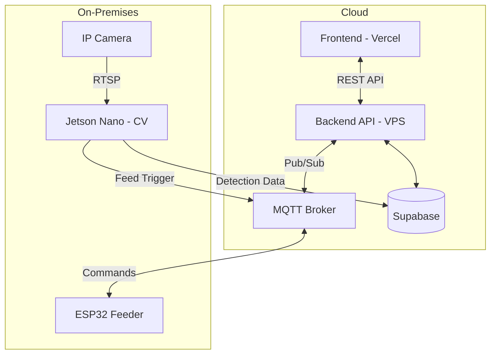

<p align="center">
  
</p>

<h1 align="center">Smart Ngangon</h1>

<p align="center">
  Platform Peternakan Kambing Cerdas berbasis AI dan IoT
</p>

<p align="center">
  <a href="https://smartngon.com">🌐 Live Demo</a> •
  <a href="#quick-start">🚀 Quick Start</a> •
  <a href="#deployment">📦 Deployment</a>
</p>

---

## Deskripsi

**Smart Ngangon** adalah sistem manajemen peternakan kambing modern yang mengintegrasikan teknologi Computer Vision, IoT, dan web dashboard. Platform ini memungkinkan peternak untuk memantau, mengontrol pakan, dan melacak kondisi ternak secara real-time dari mana saja.

---

## Fitur Utama

| Fitur | Deskripsi |
|-------|-----------|
| 📹 **Live Camera** | Streaming video real-time dari kandang |
| 🤖 **AI Detection** | Deteksi keberadaan dan perilaku kambing menggunakan YOLOv8 |
| 🍽️ **Smart Feeding** | Kontrol pakan otomatis dan manual via MQTT |
| 📍 **Zonal Tracking** | Visualisasi lokasi kambing dalam area kandang |
| 🛒 **Marketplace** | Katalog jual-beli kambing dengan checkout WhatsApp |
| 📊 **Dashboard** | Monitoring kesehatan, statistik, dan notifikasi |

---

## Arsitektur



---

## Tech Stack

| Layer | Teknologi |
|-------|-----------|
| Frontend | Next.js 16, React 19, Tailwind CSS |
| Backend | Python, FastAPI, Uvicorn |
| AI/CV | YOLOv8, Ultralytics |
| Database | Supabase (PostgreSQL) |
| IoT | ESP32, MQTT (Mosquitto), Servo Motor |
| Hosting | Vercel (Frontend), DigitalOcean VPS (Backend) |

---

## Struktur Proyek

```
smart-ngangon/
├── frontend/           # Next.js web application
│   ├── src/
│   └── public/
├── backend-python/     # FastAPI server + AI service
│   ├── routers/
│   ├── services/
│   └── main.py
├── firmware/           # ESP32 Arduino code
├── SMARTNGON_CV/       # YOLO training files
└── docs/               # Documentation
```

---

## Quick Start

**Prasyarat:** Node.js 18+, Python 3.9+

```bash
# 1. Clone repository
git clone https://github.com/ntshap/smartngon.git
cd smartngon

# 2. Install frontend dependencies
cd frontend
npm install

# 3. Setup Python backend
cd ../backend-python
python -m venv venv
source venv/bin/activate    # Windows: venv\Scripts\activate
pip install -r requirements.txt

# 4. Download YOLO model (if using local inference)
# Download best.pt from your trained model

# 5. Setup environment variables
cp .env.example .env
# Edit .env with your Supabase credentials

# 6. Run development servers
# Terminal 1 - Backend:
cd backend-python && source venv/bin/activate && uvicorn main:app --reload

# Terminal 2 - Frontend:
cd frontend && npm run dev
```

**Access:**
- Frontend: `http://localhost:3000`
- Backend API: `http://localhost:8000`
- API Docs: `http://localhost:8000/docs`

---

## Deployment

### Production URLs
| Service | URL |
|---------|-----|
| Frontend | https://smartngon.com |
| Backend API | https://api.smartngon.com |
| MQTT Broker | mqtt://129.212.234.195:1883 |

### Deploy Backend to VPS

```bash
# SSH to VPS
ssh root@129.212.234.195

# Clone and setup
git clone https://github.com/ntshap/smartngon.git /opt/smartngangon
cd /opt/smartngangon/backend-python
python3 -m venv venv
source venv/bin/activate
pip install -r requirements.txt

# Create .env file with production credentials
# Start with systemd service
```

See [docs/deployment.md](docs/) for full deployment guide.

---

## Environment Variables

### Backend (.env)
```env
SUPABASE_URL=https://xxx.supabase.co
SUPABASE_KEY=your-service-key
MQTT_BROKER=localhost
MQTT_PORT=1883
```

### Frontend (.env.local)
```env
NEXT_PUBLIC_SUPABASE_URL=https://xxx.supabase.co
NEXT_PUBLIC_SUPABASE_ANON_KEY=your-anon-key
NEXT_PUBLIC_API_URL=https://api.smartngon.com
```

---

## API Endpoints

| Method | Endpoint | Description |
|--------|----------|-------------|
| GET | `/` | Health check |
| GET | `/health` | Server status |
| POST | `/cv/analyze` | Analyze image with YOLO |
| POST | `/iot/feed/{goat_id}` | Trigger feeding |
| GET | `/iot/wifi/scan` | Scan WiFi networks |

---

## License

© 2025 Smart Ngangon Team. All rights reserved.
