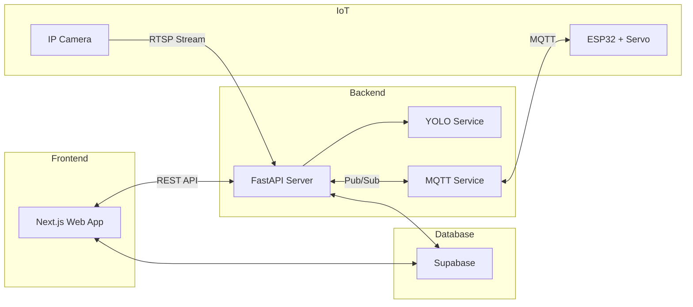

<p align="center">
  
</p>

<h1 align="center">Smart Ngangon</h1>

<p align="center">
  Platform Peternakan Kambing Cerdas berbasis AI dan IoT
</p>

---

## Deskripsi

**Smart Ngangon** adalah sistem manajemen peternakan kambing modern yang mengintegrasikan teknologi Computer Vision, IoT, dan web dashboard. Platform ini memungkinkan peternak untuk memantau, mengontrol pakan, dan melacak kondisi ternak secara real-time dari mana saja.

---

## Fitur Utama

| Fitur | Deskripsi |
|-------|-----------|
| **Live Camera** | Streaming video real-time dari kandang |
| **AI Detection** | Deteksi keberadaan dan perilaku kambing menggunakan YOLOv8 |
| **Smart Feeding** | Kontrol pakan otomatis dan manual via MQTT |
| **Zonal Tracking** | Visualisasi lokasi kambing dalam area kandang |
| **Marketplace** | Katalog jual-beli kambing dengan checkout WhatsApp |
| **Dashboard** | Monitoring kesehatan, statistik, dan notifikasi |

---

## Arsitektur



---

## Tech Stack

| Layer | Teknologi |
|-------|-----------|
| Frontend | Next.js 16, React 19, Tailwind CSS |
| Backend | Python, FastAPI, Uvicorn |
| AI/CV | YOLOv8, Ultralytics |
| Database | Supabase (PostgreSQL) |
| IoT | ESP32, MQTT, Servo Motor |
| Maps | Leaflet, React-Leaflet |

---

## Struktur Proyek

```
smart-ngangon-main/
├── frontend/           # Next.js web application
│   ├── src/
│   └── public/
├── backend-python/     # FastAPI server + AI service
│   ├── routers/
│   ├── services/
│   └── main.py
├── firmware/           # ESP32 Arduino code
├── SMARTNGON_CV/       # YOLO training files
├── docs/               # Documentation
└── package.json        # Root scripts (concurrent dev)
```

---

## Quick Start

**Prasyarat:** Node.js 18+, Python 3.9+

```bash
# 1. Clone repository
git clone https://github.com/your-repo/smart-ngangon.git
cd smart-ngangon-main

# 2. Install dependencies
npm install
npm run install:all

# 3. Setup Python backend
cd backend-python
python -m venv venv
source venv/bin/activate    # Windows: venv\Scripts\activate
pip install -r requirements.txt
cd ..

# 4. Jalankan semua (frontend + backend)
npm run dev
```

Buka browser:
- Frontend: `http://localhost:3000`
- Backend API: `http://localhost:8000`

---

## Scripts

| Command | Deskripsi |
|---------|-----------|
| `npm run dev` | Jalankan frontend + backend bersamaan |
| `npm run dev:frontend` | Jalankan frontend saja |
| `npm run dev:backend` | Jalankan backend saja |

---

## Lisensi

© 2025 Smart Ngangon Team. All rights reserved.
